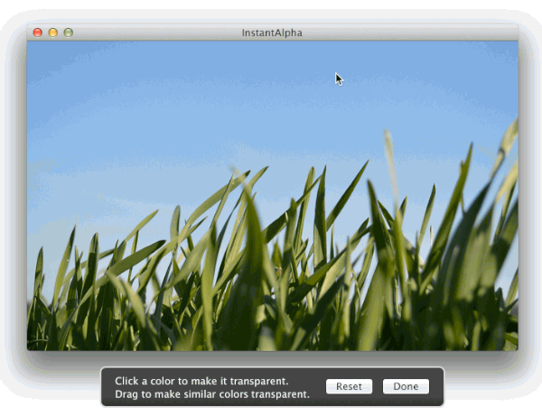

# RPInstantAlpha

Easily allow users to remove the background from an image, just like in iWork

## Usage

To run the example project; clone the repo, and run `pod install` from the Example directory first.

## Installation

RPInstantAlpha is available through [CocoaPods](http://cocoapods.org), to install
it simply add the following line to your Podfile:

    pod "RPInstantAlpha"

## Contact

Follow Robots & Pencils on Twitter ([@robotsNpencils](https://twitter.com/robotsNpencils))

### Maintainers

- [Brandon Evans](http://github.com/interstateone) ([@interstateone](https://twitter.com/interstateone))

## License

RPInstantAlpha is available under the MIT license. See the LICENSE file for more info.

The example application includes the photo [Grass](https://www.flickr.com/photos/jogibaer2/13991697118/) by [JogiBaer2](https://www.flickr.com/photos/jogibaer2). It is licensed as [CC BY 2.0](https://creativecommons.org/licenses/by/2.0/legalcode).
